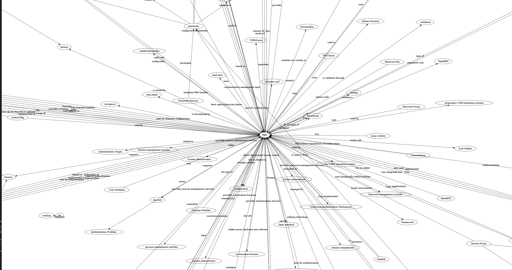

# Text to graph
This project is just a fun practice in LLM for someone without AI knowledge.
The purpose is extracting information from PDF files.

This project represent semantic network of entities in a PDF using Gorq.
Create `.env` and add your gorq `API_KEY`. Then you can get result from this project.

# Usage

```bash
go build .
./text2graph -i data/file.pdf | dot -Tx11
```

## Dependecies
- Unix system
- pdftotext
- dot (graphviz)
